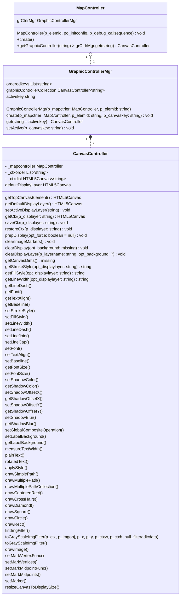

# RISCO JS map image content generation

Rui Cavaco, Feb 2022

RISCO JS is, at present day, a map image generator and manager completely relying on HTML5 Canvas.

This document describes:

- the graphics contexts used, their management, and respective **canvas** elements
- the image generation lifecycle  
- the process of generating the map image

## *Canvas* element

«*The Canvas API provides a means for drawing graphics via JavaScript and the HTML* &lt;canvas&gt; *element. Among other things, it can be used for animation, game graphics, data visualization, photo manipulation, and real-time video processing.*

*The Canvas API largely focuses on 2D graphics. The WebGL API, which also uses the &lt;canvas&gt; element, draws hardware-accelerated 2D and 3D graphics.*»

-- from [MDN Web Docs](https://developer.mozilla.org/en-US/docs/Web/API/Canvas_API)

The ***canvas*** element is an HTML DOM element filling a rectangular area in the document over which vector and raster graphics are rendered.

## Graphic contexts and *canvas* elements

## UML Diagrams

